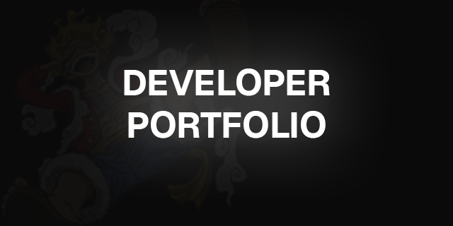

# World-Class SDE Portfolio 🚀

**Mohammed Qizar Bilal - Software Development Engineer**

> Engineered, not decorated.

A premium black-themed portfolio designed specifically for Software Development Engineers. Built with Next.js, featuring terminal aesthetics, glass morphism, and engineering-focused content presentation.

## 🎨 Design Philosophy

- **Black Glass Theme**: Deep matte blacks (#0B0D10) with glass panels (#111418)
- **Engineering First**: Every section focuses on technical credibility
- **Premium Restraint**: No gradients everywhere, no neon nonsense
- **Inspired By**: GitHub × Stripe × Linear × Vercel

## ✨ Features

### 🔧 Technical Stack
- **Next.js 14+**: App Router with React Server Components
- **Tailwind CSS**: Custom glass utilities and design system
- **Framer Motion**: Smooth, performant animations
- **React Icons**: HeroIcons & FontAwesome integration
- **TypeScript Ready**: Type-safe development

### 📐 Architecture
- **Single-Scroll Design**: No page reloads, engineered UX
- **Persistent Sidebar**: Always accessible navigation
- **Responsive**: Mobile-first with desktop excellence
- **Performance**: Optimized animations, lazy loading, sub-2s loads

## 🚀 Getting Started

### Prerequisites

- [Node.js](https://nodejs.org/) (v16 or later)
- [Git](https://git-scm.com/)

### Installation

1. Clone the repository:

   ```bash
   git clone https://github.com/QizarBilal/portfolio-website.git
   cd portfolio-website
   ```

2. Install dependencies:

   ```bash
   npm install
   ```

3. Add your assets to `public/` folder:
   - `avatar.jpg` - Sidebar profile photo (400x400px)
   - `portrait.jpg` - Hero section image (600x600px, optional)
   - `resume.pdf` - Your resume
   - `logo.png` - Site favicon

4. Start development server:

   ```bash
   npm run dev
   ```

5. Open [http://localhost:3000](http://localhost:3000) in your browser

## 📁 Project Structure

```
Portfolio-2026/
├── app/
│   ├── (home)/
│   │   ├── page.jsx                 # Main landing page
│   │   └── components/
│   │       ├── TerminalHero.jsx     # Terminal-style hero
│   │       ├── AboutSection.jsx     # SDE identity & stats
│   │       ├── ExperienceSection.jsx # Problem→Action→Impact
│   │       ├── ProjectsSection.jsx  # Case study modals
│   │       ├── SkillsSection.jsx    # Engineering stack
│   │       ├── ResumeSection.jsx    # Resume preview
│   │       └── ContactSection.jsx   # Contact info
│   ├── globals.css                  # Black glass design system
│   └── layout.js                    # Root layout with sidebar
├── components/
│   ├── Sidebar/                     # Persistent navigation
│   └── ui/                          # Reusable components
└── public/                          # Static assets
```

## 🎨 Customization Guide

### Update Personal Information

**In `components/Sidebar/index.jsx`:**
- Change name, role, and location

**In `app/(home)/components/ContactSection.jsx`:**
- Update email, LinkedIn, GitHub links

### Add Your Projects

Edit `app/(home)/components/ProjectsSection.jsx`:

```javascript
const projects = [
  {
    name: 'Your Project',
    category: 'System|ML|Platform',
    status: 'Production-ready',
    problem: 'What problem did it solve?',
    approach: 'Your engineering decisions',
    outcome: 'Measurable results',
    tech: ['React', 'Python', 'etc'],
    github: 'https://github.com/...',
    live: 'https://your-demo.com',
    metrics: [
      { label: 'Performance', value: '95%' }
    ]
  }
]
```

### Update Experience

Edit `app/(home)/components/ExperienceSection.jsx` following the Problem→Action→Impact format.

### Modify Skills

Edit `app/(home)/components/SkillsSection.jsx` to match your tech stack.

## 🎯 Color System

```css
/* Core Colors */
--base: #0B0D10          /* Background */
--surface: #111418       /* Glass panels */
--accent-green: #10b981  /* Primary accent */
--text-primary: #EDEDED  /* Main text */
--text-muted: #9AA0A6    /* Secondary text */

/* Utility Classes */
.glass              /* Standard glass effect */
.glass-strong       /* Stronger glass effect */
.terminal           /* Terminal styling */
.text-gradient-green /* Gradient text */
```

## 🚀 Deployment

### Vercel (Recommended)

```bash
vercel
```

### Build for Production

```bash
npm run build
npm start
```

## 📱 Sections

1. **Terminal Hero** - Animated commands, CTA buttons
2. **About** - SDE identity, stats (CGPA, projects, experience)
3. **Experience** - Internships with impact metrics
4. **Projects** - Case studies with modals
5. **Skills** - Engineering stack by category
6. **Resume** - PDF preview and download
7. **Contact** - Links and engineering quote

## 📝 Content Guidelines

### Write Like an SDE:
- ✅ "Reduced API latency by 80% using Redis caching"
- ❌ "Made the app faster"

### Show Engineering:
- Use metrics (10K users, 95% uptime)
- Mention trade-offs and decisions
- Focus on production systems
- Highlight scalability

## 🐛 Troubleshooting

**Images not loading?**
- Ensure files are in `public/` folder
- Use `/avatar.jpg` not `./avatar.jpg`

**Sidebar missing on mobile?**
- Click hamburger menu (top left)

**Build errors?**
```bash
rm -rf .next node_modules
npm install
npm run build
```

## 📄 License

MIT License

## 🙏 Credits

Designed and built by Mohammed Qizar Bilal  
Inspired by: GitHub, Stripe, Linear, Vercel

---

**"Engineering > Everything"**

*Built with discipline, clarity, and intent.*
   - `resume.pdf` - Your resume
   - `logo.png` - Site favicon

4. Start development server:

   ```bash
   npm run dev
   ```


